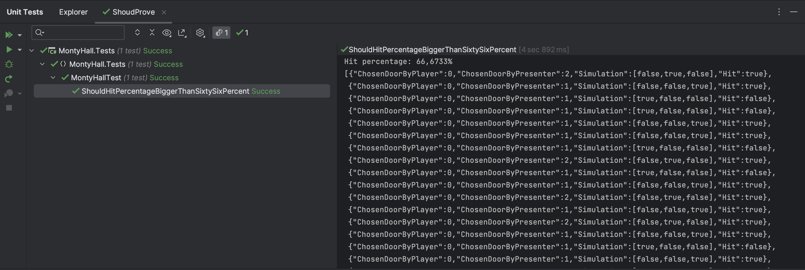

# Monty Hall Problem Backend

An backend application that proves the monty hall paradox. Users can simulate a given number of games and decide whether change the door or not.

This application is simply built with AWS API Gateway and Lambda function. And the infrastructures are deployed with serverless. 

Users can send a request with the given number of simulations through the API gateway. The request will trigger the lambda function behind the scene to run the simulation. In the end, users will get results of simulations.

## Prerequisites
| Name                   | Installation                                                                                                         |
| ---------------------- | -------------------------------------------------------------------------------------------------------------------- |
| AWS CLI                | https://docs.aws.amazon.com/cli/latest/userguide/getting-started-install.html                                        |
| .NET 6 SDK             | https://learn.microsoft.com/en-us/dotnet/core/install/                                                               |
| Node v16               | https://nodejs.org/en/ (or use [nvm](https://github.com/nvm-sh/nvm))                                                 |
| Serverless Framework   | https://www.serverless.com/framework/docs/getting-started<br />`npm install -g serverless` |
| Zip                    | `sudo apt install zip`                                                                                               |

## Deploying

To deploy the application to AWS:

Make sure you set your aws credentials correctly, then run the following cmd:
```bash
bash ./deploy.sh
```

## Testing
The test `ShouldHitPercentageBiggerThanSixtySixPercent` in this project that can prove the monty hall problem.

In the test, we assume that the player always change their initial choice, so the only input is the number of simulations. 

Theoretically, if the number of simulations goes to infinity, the hit percentage is closing to `2/3`.

While in the reality, the number of simulations can't be infinity. But if the number of simulations is bigger, the hit percentage is more likely to be close to `2/3`. That is, more simulations the test is more likely to pass.

### Testing locally:
```bash
dotnet test
```
It will only show if the test passes. To see all output, you can use either use Visual Studio or Rider. Here is the output example from Rider:


### Testing against AWS:

There are two options

1. You can deploy this application to your own AWS environment and test it there.
2. You can use the following endpoint
```bash
GET https://y0phi7dva8.execute-api.eu-central-1.amazonaws.com/dev/montyhall?NumOfSimulations=1000000&AlwaysChangeChoice=true
```
It's running on my AWS environment. In the response, I limit the number of simulations to 10 to avoid high cost.

Example of the response:
 ```bash
{
    "Results": [
        {
            "ChosenDoorByPlayer": 0,
            "ChosenDoorByPresenter": 2,
            "Simulation": [
                false,
                true,
                false
            ],
            "Hit": false
        },
        ...
    ],
    "HitPercentage": 0.4
}
```
## Improvement
Sadly I don't have enough time to finish everything. I believe there are many areas that have room for improvement, including UI, authentication, CI/CD, error handling and so on. 
